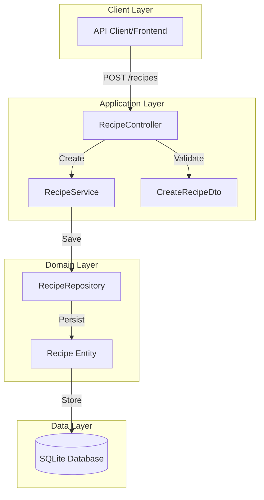
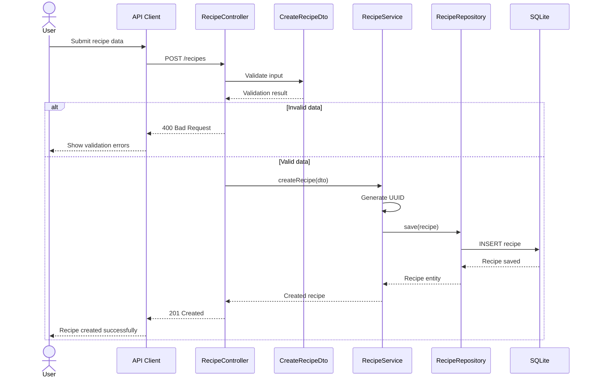

# Design Specification

## Architecture Overview

**Feature:** Recipe Creation
**Architecture Pattern:** Domain-Driven Design with Repository Pattern

## MVP Design Constraints ✅

- **Database:** Single `recipes` table with essential fields only
- **API:** Basic creation endpoint (POST /recipes)
- **UI:** N/A - API only
- **No Features:** No updates, no deletes, no versioning, no soft deletes, no user ownership

## System Architecture

### High-Level Architecture



### Key User Flow - Create Recipe



### Data Flow


## Components

### Component 1: RecipeController

**Purpose:** Handle HTTP requests for recipe operations
**Location:** `apps/api/src/recipes/recipe.controller.ts`
**Dependencies:** RecipeService, CreateRecipeDto

#### Interface

```typescript
@Controller('recipes')
export class RecipeController {
  constructor(private readonly recipeService: RecipeService) {}

  @Post()
  async create(@Body() createRecipeDto: CreateRecipeDto): Promise<Recipe> {
    return this.recipeService.create(createRecipeDto);
  }
}
```

#### Responsibilities

- Accept HTTP POST requests
- Validate request body using class-validator
- Delegate business logic to RecipeService
- Return proper HTTP status codes
- Handle validation errors

### Component 2: RecipeService

**Purpose:** Business logic for recipe operations
**Location:** `apps/api/src/recipes/recipe.service.ts`
**Dependencies:** RecipeRepository

#### Interface

```typescript
@Injectable()
export class RecipeService {
  constructor(private readonly recipeRepository: RecipeRepository) {}

  async create(createRecipeDto: CreateRecipeDto): Promise<Recipe> {
    const recipe = this.recipeRepository.create({
      ...createRecipeDto,
      id: generateUUID(),
      createdAt: new Date(),
    });
    return this.recipeRepository.save(recipe);
  }
}
```

#### Responsibilities

- Generate unique IDs for recipes
- Add system-generated fields (createdAt)
- Coordinate with repository for persistence
- Ensure business rules are applied

### Component 3: RecipeRepository

**Purpose:** Data access layer for recipes
**Location:** `apps/api/src/recipes/recipe.repository.ts`
**Dependencies:** TypeORM, Recipe Entity

#### Interface

```typescript
@Injectable()
export class RecipeRepository extends Repository<Recipe> {
  constructor(private dataSource: DataSource) {
    super(Recipe, dataSource.createEntityManager());
  }
}
```

#### Responsibilities

- Persist recipes to SQLite
- Handle database transactions
- Provide data access abstraction

## Data Models

### Model: Recipe

```typescript
@Entity('recipes')
export class Recipe {
  @PrimaryColumn('uuid')
  id: string;

  @Column({ type: 'varchar', length: 200 })
  title: string;

  @Column({ type: 'varchar', length: 500 })
  description: string;

  @Column({ type: 'json' })
  ingredients: Ingredient[];

  @Column({ type: 'json' })
  instructions: string[];

  @Column({ type: 'int' })
  prepTime: number;

  @Column({ type: 'int' })
  cookTime: number;

  @Column({ type: 'int' })
  servings: number;

  @CreateDateColumn()
  createdAt: Date;
}

interface Ingredient {
  quantity: number;
  unit: string;
  name: string;
}
```

**Validation Rules:**

- Title: Required, 1-200 characters
- Description: Required, 1-500 characters
- Ingredients: Required array, minimum 1 item
- Instructions: Required array, minimum 1 item
- PrepTime: Required, positive integer
- CookTime: Required, positive integer
- Servings: Required, positive integer

### DTO: CreateRecipeDto

```typescript
export class CreateRecipeDto {
  @IsNotEmpty()
  @IsString()
  @Length(1, 200)
  title: string;

  @IsNotEmpty()
  @IsString()
  @Length(1, 500)
  description: string;

  @IsArray()
  @ArrayMinSize(1)
  @ValidateNested({ each: true })
  @Type(() => IngredientDto)
  ingredients: IngredientDto[];

  @IsArray()
  @ArrayMinSize(1)
  @IsString({ each: true })
  @IsNotEmpty({ each: true })
  instructions: string[];

  @IsInt()
  @Min(1)
  prepTime: number;

  @IsInt()
  @Min(1)
  cookTime: number;

  @IsInt()
  @Min(1)
  servings: number;
}

export class IngredientDto {
  @IsNumber()
  @Min(0.01)
  quantity: number;

  @IsNotEmpty()
  @IsString()
  unit: string;

  @IsNotEmpty()
  @IsString()
  name: string;
}
```

## API Design

### Endpoint: Create Recipe

```http
POST /recipes
Content-Type: application/json

{
  "title": "Spaghetti Carbonara",
  "description": "Classic Italian pasta with eggs, cheese, and pancetta",
  "ingredients": [
    { "quantity": 400, "unit": "grams", "name": "spaghetti" },
    { "quantity": 200, "unit": "grams", "name": "pancetta" },
    { "quantity": 4, "unit": "whole", "name": "eggs" },
    { "quantity": 100, "unit": "grams", "name": "Pecorino Romano" }
  ],
  "instructions": [
    "Boil pasta in salted water until al dente",
    "Fry pancetta until crispy",
    "Mix eggs and cheese in a bowl",
    "Combine pasta with pancetta, then add egg mixture off heat"
  ],
  "prepTime": 10,
  "cookTime": 15,
  "servings": 4
}
```

**Success Response (201 Created):**

```json
{
  "id": "550e8400-e29b-41d4-a716-446655440000",
  "title": "Spaghetti Carbonara",
  "description": "Classic Italian pasta with eggs, cheese, and pancetta",
  "ingredients": [
    { "quantity": 400, "unit": "grams", "name": "spaghetti" },
    { "quantity": 200, "unit": "grams", "name": "pancetta" },
    { "quantity": 4, "unit": "whole", "name": "eggs" },
    { "quantity": 100, "unit": "grams", "name": "Pecorino Romano" }
  ],
  "instructions": ["Boil pasta in salted water until al dente", "Fry pancetta until crispy", "Mix eggs and cheese in a bowl", "Combine pasta with pancetta, then add egg mixture off heat"],
  "prepTime": 10,
  "cookTime": 15,
  "servings": 4,
  "createdAt": "2025-10-25T14:00:00Z"
}
```

**Error Response (400 Bad Request):**

```json
{
  "statusCode": 400,
  "message": ["title must be longer than or equal to 1 characters", "ingredients must contain at least 1 elements", "prepTime must not be less than 1"],
  "error": "Bad Request"
}
```

## Technology Decisions

### Backend

- **Runtime:** Node.js (existing)
- **Framework:** NestJS (existing)
- **Database:** SQLite with TypeORM
- **Validation:** class-validator and class-transformer
- **UUID Generation:** Native crypto.randomUUID()

### Database Choice Rationale

- **SQLite:** Chosen for MVP simplicity
  - Zero configuration required
  - File-based, no server needed
  - Perfect for development and small-scale deployments
  - Easy to migrate to PostgreSQL later if needed

### ORM Choice Rationale

- **TypeORM:** Selected for NestJS integration
  - Official NestJS support and documentation
  - Decorator-based entity definition aligns with NestJS patterns
  - Built-in SQLite support
  - JSON column type for nested structures (ingredients, instructions)

## Security Considerations

- Input validation using class-validator decorators
- SQL injection prevention via TypeORM parameterized queries
- Payload size limit: 100KB (configured in NestJS)
- UTF-8 character support for international recipes

## Performance Requirements

- Recipe creation response time < 200ms
- Database write operations < 50ms
- No caching needed for MVP (single write operation)

## Integration Points

- **TypeORM:** Database abstraction layer
- **class-validator:** Request validation
- **SQLite:** Data persistence
- No external API integrations

## Error Handling Strategy

- **Validation Errors:** Return 400 with detailed field errors
- **Database Errors:** Log and return generic 500 error
- **Logging:** Use NestJS built-in logger
- **User Feedback:** Clear validation messages in response

## Testing Strategy

### E2E Testing Approach

**Philosophy:** Real services over mocks. Test actual recipe creation flow.

**Test Stack:**

- **Cucumber**: BDD scenarios for recipe creation
- **Playwright**: API testing capabilities
- **Docker Compose**: Orchestrate test environment
- **Real Services**: Actual NestJS app with in-memory SQLite

**Test Environment:**

```yaml
# Required services for E2E tests
services:
  - api: NestJS application
  - database: In-memory SQLite (test mode)
```

**Test Coverage:**

- **Happy Path**: Create recipe with all valid fields
- **Validation Cases**: Missing fields, invalid data types, boundary values
- **Edge Cases**: Maximum length strings, minimum numeric values, Unicode characters

**Mocking Exceptions:**

- None - all services are local and free

**Test Data Management:**

- Database reset strategy: New in-memory DB for each test suite
- Fixture location: `apps/api-e2e/src/fixtures/recipes/`
- Cleanup approach: Automatic with in-memory database

## Module Structure

```
apps/api/src/
├── recipes/
│   ├── recipe.module.ts
│   ├── recipe.controller.ts
│   ├── recipe.controller.spec.ts
│   ├── recipe.service.ts
│   ├── recipe.service.spec.ts
│   ├── recipe.repository.ts
│   ├── entities/
│   │   └── recipe.entity.ts
│   └── dto/
│       ├── create-recipe.dto.ts
│       └── ingredient.dto.ts
└── app.module.ts (import RecipeModule)
```

## Database Schema

```sql
CREATE TABLE recipes (
    id VARCHAR(36) PRIMARY KEY,
    title VARCHAR(200) NOT NULL,
    description VARCHAR(500) NOT NULL,
    ingredients JSON NOT NULL,
    instructions JSON NOT NULL,
    prep_time INTEGER NOT NULL CHECK (prep_time > 0),
    cook_time INTEGER NOT NULL CHECK (cook_time > 0),
    servings INTEGER NOT NULL CHECK (servings > 0),
    created_at DATETIME DEFAULT CURRENT_TIMESTAMP
);
```
